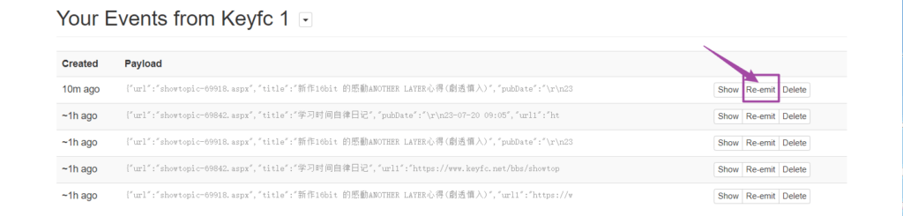

+++
title = '如何制作一个 RSS 源'
date = 2023-10-15T12:54:54+08:00
categories = [
    "RSS",
    "Telegram Bot",
]
tags = [
    "RSS",
    "Huginn",
    "Telegram Bot",
]
image = "cover.png"
+++

如果你对 RSS 有一定的了解，可以查看右边的索引，跳转到自己需要的地方唷><

## 什么是 RSS 呢

> ~~梦开始的地方~~
> 
> 简单来说，RSS就像是一个新闻订阅服务，用户可以通过订阅自己喜欢的网站的RSS源，获取这些网站的最新内容和更新，而无需每次都去访问这些网站。用户可以将订阅的RSS源集中在一个地方，方便浏览和阅  
> 读。 -ChatGPT

## 如何使用 RSS 源

[RSSHub](https://docs.rsshub.app/zh/) 提供了一些公共RSS源，搜索自己喜欢的网站进行查找

这里以月幕Gal RSS源为例：


最后的最后，复制链接到RSS阅读器，点击添加订阅就可以啦w

Twitter的RSS源可以看这篇：[Nitter Rss 403 的解决方案](https://tia-chan.top/p/nitter-rss-403-%E7%9A%84%E8%A7%A3%E5%86%B3%E6%96%B9%E6%A1%88/)

手机端RSS阅读器可以使用开源的 [Feeder](https://f-droid.org/packages/com.nononsenseapps.feeder/)

电脑端RSS阅读器可以使用开源的 [Fluent Reader](https://github.com/yang991178/fluent-reader/releases)

想要全平台同步可以使用公共 [Telegram机器人](https://t.me/RSStT_Bot) 订阅RSS源，由于是公共的可能会有延迟，下面将会介绍如何部署一个自己的Telegram机器人wwww

## 如何制作自己的 RSS 源

~~呜呜呜呜呜呜！找不到自己喜欢的RSS源怎么办，那当然是去[RSSHub](https://github.com/DIYgod/RSSHub/issues)上提issues呀~~

~~那人家也不理我怎么办qwq~~

那就自己来做一个！利用[huginn](https://github.com/huginn/huginn/)制作RSS源

### 下载安装篇

#### 在linux中安装docker

```dsconfig
curl -fsSL get.docker.com -o get-docker.shsudo sh get-docker.sh --mirror Aliyun
```

#### 启动docker容器（等待一分钟左右）

```apache
screen -S huginndocker run -it -p 3000:3000 ghcr.io/huginn/huginn
```

最后 `ctrl+a+d` 退出 screen

#### 在浏览器中打开Huginn

[http://localhost:3000](http://localhost:3000/)

localhost替换为你自己的ip，然后打开（如图）


点击login，用户名与密码分别默认为admin与password

#### 设置账户

为保证账户安全，点击account菜单，选择account修改账户密码


### 为Huginn使用做准备

#### 准备 [phantomjscloud](https://dashboard.phantomjscloud.com/) Apikey

需要注册一个[phantomjscloud](https://dashboard.phantomjscloud.com/)账户，用来渲染动态网页成静态页面，注册好后从中获取ApiKey


#### 在Huginn中新建凭证（Credentials）

在Huginn中使用ApiKey


### 如何使用Huginn

#### 概述

一共分为4步：

1. 利用PhantomJs agent将动态网页转成静态网页
2. 利用Website agent解析提取文章标题
3. 利用Website agent解析提取文章内容
4. 利用DataOutputAgent将解析的东西转成RSS源

#### 将动态网页转成静态网页

这里以制作[Keyfc论坛](https://www.keyfc.net/bbs/showtopiclist.aspx?type=newtopic) RSS源为例

点击新建代理（Agent）（没有说明的内容默认就行，不需要填写）


---


--- 


User agent：

```apache
Mozilla/5.0 (Windows NT 10.0; WOW64) AppleWebKit/537.36 (KHTML, like Gecko) Chrome/117.0.0.0 Safari/537.36
```

#### 提取文章标题与时间

点击新建代理（Agent）（Website Agent类型）


---


获取xpath路径可以用f12弹出控制台，然后点击选择元素，之后在页面中选择标题


点击文章标题可以看见这个样子


我们可以在控制台看见文章标题，右键选中，点击copy full xpath


可以看见完整的xpath路径是这个样子的

```css
/html/body/div[4]/div[3]/div/div[3]/table/tbody[1]/tr/th/a[1]
```

由于不同文章的xpath路径有可能不同，所以我们需要对这个路径做一些修改(不然抓取的文章只有这一个)

我们主要通过对比不同文章之间的xpath路径进行修改

以相同方式，复制第二篇文章完整xpath路径，如下

```css
/html/body/div[4]/div[3]/div/div[3]/table/tbody[2]/tr/th/a[1]
```

**方法**：找不同，来删除 ~~（快背，快背，考试要考的><）~~

通过对比，可以看见最后的部分不同，删除不同之处，可以得到下面的xpath

```css
/html/body/div[4]/div[3]/div/div[3]/table/tbody/tr/th/a[1]
```

那有的时候通过对比，没有不同之处怎么办呢？

~~笨...笨蛋！不修改不就行了嘛~~

以相同的方式获取发布时间


分别获取的第一篇与第二篇文章的发布时间

```css
/html/body/div[4]/div[3]/div/div[3]/table/tbody[1]/tr/td[3]/em
/html/body/div[4]/div[3]/div/div[3]/table/tbody[2]/tr/td[3]/em
```

删除两者不同的地方，得到一下内容

```css
/html/body/div[4]/div[3]/div/div[3]/table/tbody/tr/td[3]/em
```

点击两次Dry Run运行下看看


抓取成功啦，但是url有些问题，可以使用模板（template）使它们拼接起来


---


```handlebars
"template": {    "url1": "{{ url | to_uri: _response_.url }}"  }
```

点击两次Dry Run运行下看看


完成！

#### 提取文章内容

点击新建代理（Agent）（Website Agent类型）


点击标题链接查看文章内容，并以相同方式获取xpath路径


分别获取的第一篇与第二篇文章的内容xpath路径

```css
/html/body/div[4]/div[5]/div/form[1]/div/table[1]/tbody[1]/tr/td[2]/div[4]/div[2]/div/html/body/div[4]/div[5]/div/form[1]/div/table[1]/tbody[1]/tr/td[2]/div[4]/div[2]/div
```

通过对比没有不同之处，不需要修改


---


完成！

#### 转成RSS源


---


---


点击actions菜单，选择show


这个后缀为.xml的链接就是你做的RSS源啦（啪唧啪唧，鼓掌www）

#### 常见问题

如果遇到下面的working状态为no


记得点击抓取标题的那个代理的event created（即keyfc 1）


重新发送一个就好啦（记得不要发送相同的内容，不然会重复）



## 部署 Telegram RSS Reader Bot

项目地址：[Bot](https://github.com/Rongronggg9/RSS-to-Telegram-Bot "RSS-to-Telegram-Bot")

### 部署

#### 下载安装篇

```awk
mkdir rssttcd rssttwget https://raw.githubusercontent.com/Rongronggg9/RSS-to-Telegram-Bot/dev/docker-compose.yml.sample -O docker-compose.yml
```

#### 准备与配置

转向 [@BotFather](https://t.me/BotFather) ，发送 `/newbot` 创建一个新的机器人，获取 `token`

转向 [@userinfobot](https://t.me/userinfobot) 获取您的用户 ID（环境变量：）`MANAGER`。

[获取 Telegraph API 访问令牌](https://api.telegra.ph/createAccount?short_name=RSStT&author_name=Generated%20by%20RSStT&author_url=https%3A%2F%2Fgithub.com%2FRongronggg9%2FRSS-to-Telegram-Bot)（环境变量：）`TELEGRAPH_TOKEN`。每次获得新令牌时刷新页面。如果您有很多订阅，请确保获得至少 5 个代币。


编辑 docker-compose.yml 文件，替换 `token` , `MANAGER` , `TELEGRAPH_TOKEN`

```nginx
vi docker-compose.yml
```

更新

```ebnf
docker-compose up -d
```

完结撒花！！
