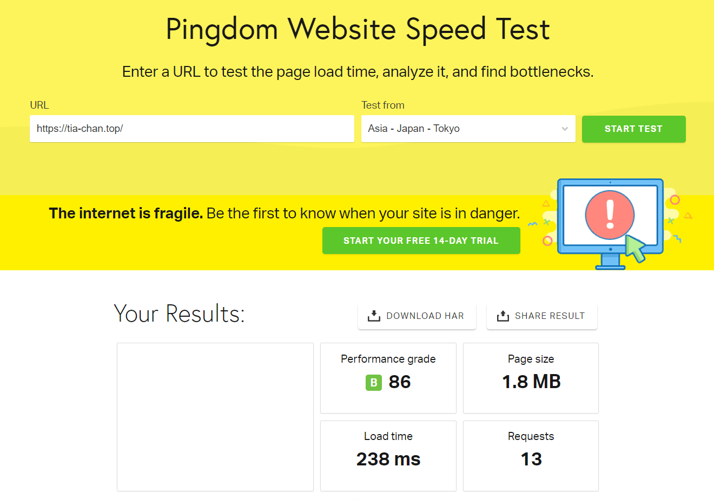
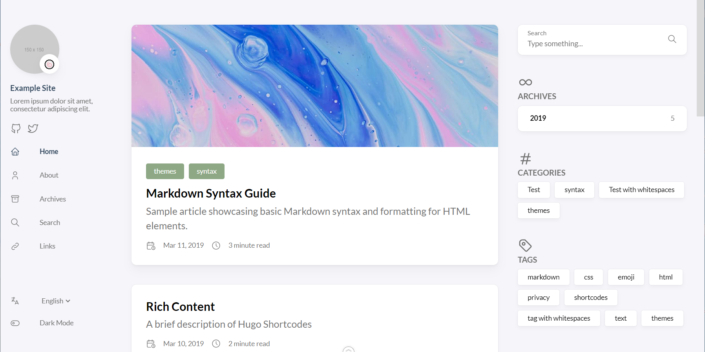
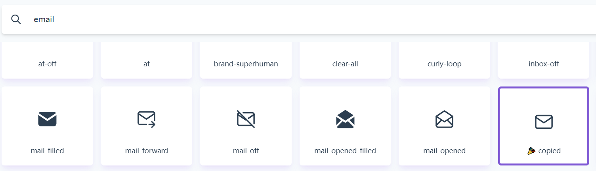
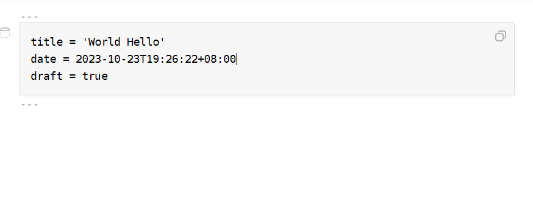
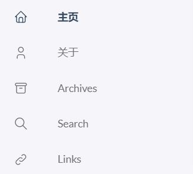

+++
title = '如何利用 Hugo 生成静态页面'
date = 2023-10-23T16:01:10+08:00
categories = [
    "Web"
]
tags = [
    "Web",
    "Hugo"
]
image = "cover.jpg"
+++

> 如果你没有时间，又想快速的搭建博客，可以使用 [Hugo](https://gohugo.io/about/) 静态页面生成器

## 介绍

有哪些优点呢？

- 文章使用 Markdown 格式

- 相较于动态页面，访问速度快，占用低

- 简单，快速部署

给大家看看访问速度 >< 



## 安装

如果你没有 winget 包管理器可以先在 [微软商店](https://apps.microsoft.com/detail/9NBLGGH4NNS1?hl=zh-cn&gl=zh) 安装

利用 winget 安装 hugo

```shell
winget install Hugo.Hugo.Extended
```

## 新建模板

右键桌面，选择在终端中打开

```shell
hugo new site blog
```

切换目录

```shell
cd blog\themes
```

## 主题

在 [hugo theme](https://themes.gohugo.io/) 中寻找你喜欢的主题

找到后，点击 download 跳转到 github 仓库

点击 Code 菜单栏，复制仓库地址

克隆到 blog 文件夹的 themes 文件夹中

```shell
git clone <仓库地址>
```

进入克隆好的文件夹，转到 exampleSite 文件夹，找到 content 文件夹和 config.yaml 文件，分别复制到 blog 文件夹下

如遇到提示信息，选择替换目标中的文件

最后删除 blog 文件夹下的 config.toml 文件

## 使用与配置

### 运行Hugo

```shell
hugo server 
```

打开地址：

```
localhost:1313
```



如图，我这里使用的是hugo-theme-stack主题，需要配置自定义样式

### 基础设置

在修改 blog 文件夹下的 config.yaml 文件

```yaml
baseurl: https://example.com
languageCode: en-us
theme: hugo-theme-stack
paginate: 5
title: Example Site
copyright: Example Person

languages:
    en:
        languageName: English
        title: Example Site
        weight: 1
        params:
            description: Example description
    zh-cn:
        languageName: 中文
        title: 演示站点
        weight: 2
        params:
            description: 演示说明
    ar:
        languageName: عربي
        languagedirection: rtl
        title: موقع تجريبي
        weight: 3
        params:
            description: وصف تجريبي
DefaultContentLanguage: en
```

baseurl 表示你的域名

languageCode 可以修改为 zh-cn

title 表示网站名称

copyright 表示网站名称

languages 中可以看到三种语言，en、zh-cn、ar，删除两个你不需要的语言

zh-cn 中的title表示侧边栏/网站的名称，weight表示语言所在的权重（由于删除了两种语言，建议改为1）

<mark>修改后，如果你打开页面发现报错了，没关系，是因为你还没有设置默认内容语言（如下）</mark>

DefaultContentLanguage 需要把语言改为 zh-cn

### 修改侧边栏头像

在 config.yaml 文件中我们可以看见下列代码

```yaml
sidebar:
        emoji: 🍥
        subtitle: Lorem ipsum dolor sit amet, consectetur adipiscing elit.
        avatar:
            enabled: true
            local: true
            src: img/avatar.png
```

可以看出存放头像图片的路径是 blog\assets\img\avatar.png

修改一下就好啦

如果不想要 ```emoji``` 可以删掉，```subtitle``` 表示个性签名，你可以自定义

### 修改标签页图标

打开 config.yaml 找到以下内容

```yaml
favicon: # e.g.: favicon placed in `static/favicon.ico` of your site folder, then set this field to `/favicon.ico` (`/` is necessary)
```

根据提示完善代码 (修改成下面的样子)

```yaml
favicon: /favicon.ico # e.g.: favicon placed in `static/favicon.ico` of your site folder, then set this field to `/favicon.ico` (`/` is necessary)
```

自定义图标存放在 static/favicon.ico 路径下

### 修改关联社交账号

在 config.yaml 文件中我们可以看见下列代码

```yaml
menu:
 main: []

 social:
    - identifier: github
      name: GitHub
      url: https://github.com/CaiJimmy/hugo-theme-stack
      params:
          icon: brand-github

    - identifier: twitter
      name: Twitter
      url: https://twitter.com
      params:
          icon: brand-twitter
```

identifier 表示id序列，随便写

name 表示社交平台的名字

url 表示社交平台账户的名字

icon 表示图标 （存储在 blog\themes\你的主题文件\assets\icons中）

社交图标可以自定义，默认只有两个，你可以在 [tablericons](https://tablericons.com/) 找到你所需要的图标 



这里以邮箱图标为例（我才，才不会说举邮箱的例子是因为有点特殊呢！！），找到后，点击一下，显示 copied 就表示复制成功啦

在 blog\themes\你的主题名称\assets\icons 中创建一个svg格式的文件，文件名随便你取，我取的是 brand-email.svg，把复制的东东，粘贴到文件中就可以啦

```yaml
identifier: email
name: Email
url: mailto:你的邮箱地址
params:
    icon: brand-email
```

icon 中填写的是你刚刚创建svg文件所取的名字

邮箱的url比较特殊，并不是直接填邮箱就可以了，需要在前面加上 mailto:

### 创建文章

```shell
hugo new post\你的文章名称\index.md
```

创建的文件存放在 blog\content\post\你的文章名称\index.md 中

打开 index.md 可以看到下图所示



引入眼帘的，明显有一部分是代码块，下面是一片空白

这里的代码块比较特殊，人们把它称为 front matter, 即**文件的元信息**

title 表示文章名称

date 表示日期

draft 表示草稿，值为true表示在首页不显示文章，false表示显示（如果删去draft则表示显示）

初始化的 front matter 默认包含这三部分，另外还有一些其他属性

```yaml
categories = [
    "分类1",
    "分类2"
]
tags = [
    "标签1",
    "标签2"
]
image = "1.jpg"
```

分别表示文章的分类，标签，封面

<mark>注意：字符串前面的，是四个空格，有时候你可能会用tab键来表示四个空格，但在这里可能会出错，因为有些环境下tab键会表示8个空格</mark>

空白处就可以用markdown语法编辑文章啦

你可以一边编辑，一边看看网页的变化

### 修改侧边栏索引



由于显示语言的不一致，需要修改一下

打开 blog\content\page 路径，可以看见侧边栏索引所在的目录

进入你需要修改的索引目录，把 index.md重命名为 index.zh-cn.md（已经有了index.zh-cn.md就不需要了）

编辑 index.zh-cn.md文件中的front matter的title就可以修改侧边栏索引啦

### 删除多余文章

删除 blog\content\post 路径中多余的文件夹就可以了

### 修改关于页面

编辑 blog\content\page\about\index.zh-cn.md 文件

### 修改链接页面

编辑 blog\content\page\links\index.zh-cn.md 文件

删除 front matter 下方的内容

```yaml
title: 链接
links:
  - title: GitHub
    description: GitHub is the world's largest software development platform.
    website: https://github.com
    image: https://github.githubassets.com/images/modules/logos_page/GitHub-Mark.png
  - title: TypeScript
    description: TypeScript is a typed superset of JavaScript that compiles to plain JavaScript.
    website: https://www.typescriptlang.org
    image: ts-logo-128.jpg
menu:
    main: 
        weight: -50
        params:
            icon: link

comments: false
```

links下的title 表示关联的网站标题（友情链接之类的）

description 表示描述信息

website 表示站点地址

image 表示关联的网站图片链接

### 生成静态页面

```shell
hugo
```

生成的静态页面存储在 public 文件夹中

如果你没有服务器可以考虑把 public 中的静态页面部署到 github 之类的托管网站

网上有很多这类的教程就不多说啦

下一篇，将介绍如何把静态页面部署到 nginx 中

完结撒花！！

~~つずく~~
