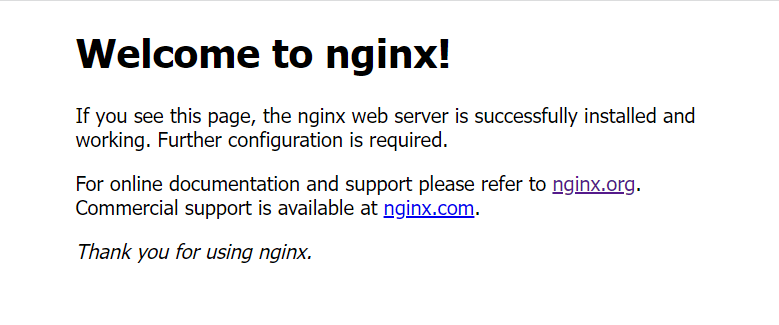

+++
title = '如何利用 Nginx 部署静态页面'
date = 2023-10-24T09:34:32+08:00
categories = [
    "Web"
]
tags = [
    "Web",
    "Nginx"
]
image = "cover.jpg"
+++

## 安装 Nginx

```shell
sudo apt install nginx
```

## 开放端口

开放80与443端口（分别表示http端口与https端口）

```shell
sudo ufw allow 80
sudo ufw allow 443
```

## 访问

在浏览器输入你的服务器ip进行访问，和下图一样就表示成功啦www



## 上传静态页面

```shell
cd /var/www/
git clone <你的静态页面仓库地址>
```

此时你的静态页面就存放在 /var/www/<仓库名称> 中啦

## Nginx 配置介绍

> 这里只是简单介绍下基础概念，后面会有详细步骤的说

/etc/nginx/ 路径下存放nginx配置文件

我们主要看这三个文件

```shell
sites-available
modules-enabled
nginx.conf
```

**sites-available目录**中存放不同的**服务器块**配置文件（里面默认有一个default文件）

每个服务器块配置文件都关联一个独立的**域名**，**根目录**（在这里指的是静态页面目录）

配置好后，需要把**服务器块**配置链接到nginx配置（**modules-enabled目录**）中，使其生效

<mark>说明：默认服务器块配置并不需要手动链接到nginx配置，因为它是自动完成的，反之则需要手动链接nginx配置</mark>

如何判断是否为默认服务器块配置呢？

打开服务器块配置文件如果看见监听端口后面有default_server则表示是默认服务器块配置文件

如下所示

```shell
listen 80 default_server;
listen [::]:80 default_server;
```

<mark>注意：只能有一个默认服务器块配置文件，访问服务器ip地址默认加载的是默认服务器块配置文件</mark>

**nginx.conf** 文件表示nginx总配置文件

## 创建服务器块（server block）

```shell
sudo vim /etc/nginx/sites-available/example.com.conf
```

其中**example.com**是你的域名

输入 **i** 切换到 **输入模式**

添加以下代码模板

```
server {
 listen 80 default_server;
 listen [::]:80 default_server;

 root /var/www/example.com/;

  index index.html index.htm index.nginx-debian.html;
  server_name your_domain www.your_domain;

 location / {
  try_files $uri $uri/ =404;
 }
}
```

**root** 表示你的静态文件存放目录

**server_name** 表示你的域名

最后，键入 **esc** 切换到 **命令模式**

输入指令 ```:wq``` 表示保存退出

<mark>由于默认服务器块只能有一个，你还需要编辑该目录的default文件</mark>

```shell
sudo vim /etc/nginx/sites-available/default
```

把里面的 default_server 删除掉就可以啦

```
listen 80 default_server;
listen [::]:80 default_server;
```

## 链接 nginx 配置

```shell
sudo ln -s /etc/nginx/sites-available/example.com.conf /etc/nginx/sites-enabled/
```

**example.com** 是你的域名

## 编辑总配置文件

打开 nginx.conf 文件

```shell
sudo vim /etc/nginx/nginx.conf
```

找到以下内容并取消注释

```
server_names_hash_bucket_size 64;
```

**server_names_hash_bucket_size** 表示增加为解析域名所分配的内存

## 刷新 nginx 配置

检查语法是否有错

```shell
sudo nginx -t
```

若输出以下代码，则表示没有问题

```shell
nginx: the configuration file /etc/nginx/nginx.conf syntax is ok
nginx: configuration file /etc/nginx/nginx.conf test is successful
```

刷新配置文件

```shell
nginx -s reload
```

打开浏览器，刷新你的服务器ip地址就可以看到你的静态页面啦！！

如果服务器ip可以访问，域名却无法访问，可以看看你的域名提供商是否配置好dns解析

## 获取Let's Encrypt SSL证书

安装 cerbot 包

```shell
sudo apt install python3-certbot-nginx
```

获取证书

```shell
sudo certbot --nginx --agree-tos --redirect --hsts --staple-ocsp --email you@example.com -d example.com
```

**you@example.com** 表示你的邮箱地址

**example.com** 表示你的域名

现在你的域名将会使用https协议啦！

## 自动续订证书

设置 cron 作业

```shell
sudo certbot renew --dry-run
```

如果没有问题，打开crontab

```shell
sudo crontab -e
```

这个时候应该会有3个选项，选择你熟悉的编辑器

然后编辑文件，指定处理时间 

```
5 4 */1 * * /usr/sbin/certbot-auto renew
```

表示在每天的4点5分检查证书，如果证书需要续订，脚本将自动更新它

如果你不想和我一样，可以在这里随机一个自己喜欢的时间点 [crontab](https://crontab.guru/)

## 使用 gzip 优化 nginx

gzip 是压缩数据的方法，使用它可以提高网站速度，减少负载

同时也能提高测速平台的性能分数！！

nginx 默认是开启 gzip 的，但需要一些其他配置

### 基础配置

打开 nginx 的总配置文件

```shell
sudo vim /etc/nginx/nginx.conf 
```

找到以下内容并取消注释

```
# gzip_types text/plain text/css application/json application/javascript text/xml application/xml application/xml+rss text/javascript;
```

### 高级配置

> 一般使用基础配置就可以啦，高级设置的提速，反正我是感觉不到的qwq

```
     # gzip_comp_level 6;
     # gzip_min_length 1000;
```

**gzip_comp_level** 表示压缩级别（0~9），值越高，压缩级别也就越高，cpu算力也就越高（建议保持中等水平4）

**gzip_min_length** 表示压缩的内容最小为多少字节（建议不要小于1000字节，因为可能会导致文件变大）

检查语法是否正确

```shell
sudo nginx -t
```

刷新一下配置文件

```shell
nginx -s reload
```

完成！！


